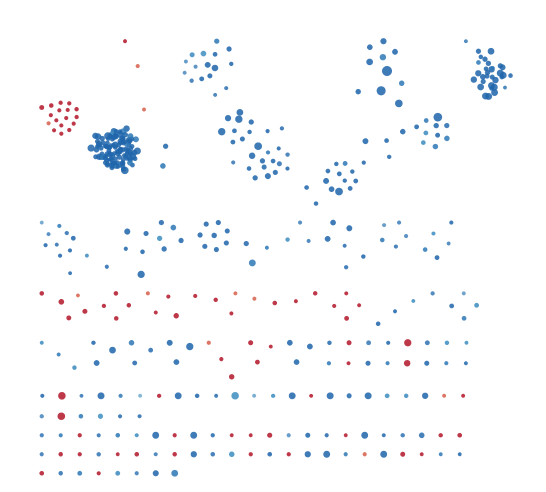
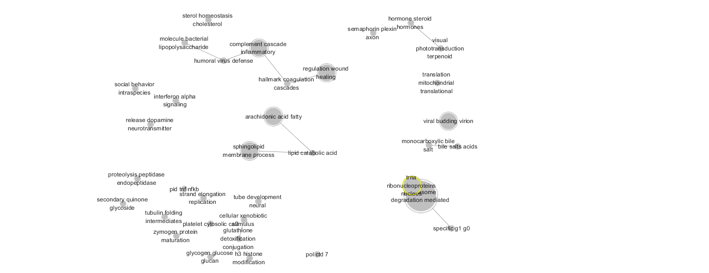
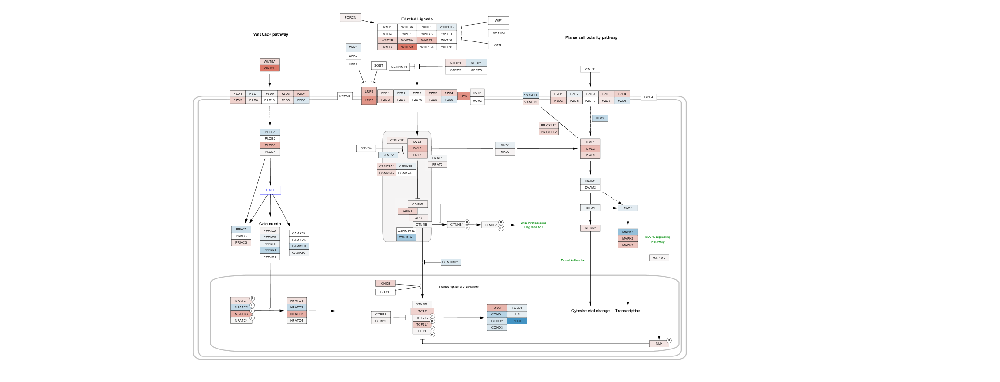

```{r, message=FALSE, echo=FALSE,warning=FALSE}
# package required for this notebook
if (!requireNamespace("BiocManager", quietly = TRUE))
  install.packages("BiocManager")
if (!requireNamespace("kableExtra", quietly = TRUE))
  install.packages("kableExtra")

library(BiocManager)
library(kableExtra)
library(readr)
library(dplyr)

```

## 1. Introduction

Lung cancer is the one of the leading cause of death from cancer and non small cell lung cancer(NSCLC) is the most common type of lung cancer, account for 85% of all lung cancer.Morever, statistics shows that the overall 5-year survival rate for NSCLC is under 20% [@nsclc2]. Recent studies have revealed the important role of G9a, a histone methyltransferase, in various cancer cells. G9a is responsible for the mono- and di-methylation of H3K9 and its overexpression was ovserved in most lung cancer cells including squamous cell carcinoma and NSCLC. 

Therefore, I choose the dataset(GSE113493) that investigate the role of dysregulated histone methyltransferase G9a in two human non-small cell lung cancer (NSCLC) cell lines. The mechanistic investigation of G9A knockdown and its role in in anti-tumor activity might be able to uncover the possible therapeutic target in NSCLC diagnosis and treatment. 

This report will carry out a further expression analysis through non-thresholded gene set enrichment analysis using GSEA. Morever, a pathway enrichment analysisi will performed by Cytoscape based on ranked genes generated from GSEA.  

## 2. Non-thresholded Gene set Enrichment Analysis

### 2.1 Method and Genesets
I use a Non-thresholded gene set enrichment analysis using GSEA(4.0.3). Ohter than focusing on s subset of gene set, GSEA performs a genomewide expression profiling analysis for specific phenotype. Morever, non-thresholded approach allows us to investigate some weak signals that might be ignored in thresholded approached in assignment. 

An enrichment score is calculated for each gene in my prerank list that indicates the correlation of the gene with Ga9 expression. This is further estimated through significance level of the correlation.

The prerank list of genes are generated through previous assignment on differential expression analysis. Low counts in the genesets were removed and the data has been normalized and scored using edgeR(3.10) package.

The list of genesets from Bader lab is used to run against each gene in prerank list to see how significantly they are enriched. 


### 2.2 Enrichment results


```{r, message=FALSE, echo=FALSE,warning=FALSE}
library(magrittr)
library(kableExtra)
pos_data <-read.delim("./gsea_report_for_na_pos_1585020285621.xls",header = TRUE,stringsAsFactors = F, sep="\t")
neg_data <-read.delim("./gsea_report_for_na_neg_1585020285621.xls",header = TRUE,stringsAsFactors = F, sep="\t")
top_pos_data <- pos_data[1:6,c(-2,-3)]
top_neg_data <- neg_data[1:6,c(-2,-3)]

kable(top_pos_data, caption = "The top genesets for Ga9 negative") %>%
  kable_styling(bootstrap_options = c("striped", "hover"))
```


* The top geneset  for Ga9 positive
  * name: RESOLUTION OF D-LOOP STRUCTURES THROUGH HOLLIDAY JUNCTION INTERMEDIATES
  * enrichment score: 0.66
  * Normalized Enrichment Score (NES): 1.973
  * 15 genes are in its leading edge
  * top gene associated with this geneset is repair protein probes XRCC2


```{r,message=FALSE, echo=FALSE,warning=FALSE}
kable(top_neg_data, caption = "The top genesets for Ga9 negative") %>%
  kable_styling(bootstrap_options = c("striped", "hover"))
```


* The top geneset  for Ga9 negative
  * name: REGULATION OF CELLULAR AMINO ACID METABOLIC PROCESS
  * enrichment score: -0.74
  * Normalized Enrichment Score (NES): -2.533
  * 15 genes are in its leading edge
  * top gene associated with this geneset is repair protein probes XRCC2
  

* Overall, the top genesets are D loop structure, DNA damage and repair, carcinoma mutations, trascription factor in wnt pathways, etc. Most of them are highly related to DNA damage, repair and wnt pathway. This is consistant with the original result in the paper that is interested in the impact of G9a in wnt pathway and if this is a tumor-related factor.  
  
### 2.3 Comparison with thresholded analysis

The result is partially consistant with thresholded analysis using Gprofile. Both of the result indicates the cell cycle control, gene damage and repair. Most of GSEA results are more detailed and specific to metabolic process. Thresholded analysis is more arbitary considering which thresholded to be used, while GSEA results gives a more specific result based on significance. 


## 3. Visualize Gene set Enrichment Analysis in Cytoscape

### 3.1 An overview of the the enrichment map
Each node represents a pathway and there are 464 nodes and 8094 edges in the resulting map. 
The enrichment map used 0.1 cut off for FDR q value.This is because FDR q value for most up-regulated gene sets in GSEA are greater then 0.07. I set the cut off as 0.1 to include some of the up-regulated genesets. 
The gene set overlapping filtering(number of edges) are calculated by the combination of Jaccard and Overlap cofficients, which is the default in cytoscape [@autoannotate].
Below is the original enrichment map without further annotation




### 3.2 annotation 
First, I applied auto annotation which group network into clusters and give the description for each cluster. 
Then I filter the clusters to include the ones that contains more than 3 terms. 

Here's a screenshot of clustered map.


To better visualize the theme of the enrichment map, I collapse the network into a theme network. MCL Cluster algorithm is performed for clustering the network and WordCloud algorithm is used to adjacent words within the labels.
Here's a screenshot of the themed map.



The biggest clusters are listed below. 

- proteasome degradation mediated

- aerobic electron cytochrome

- trna ribonucleoprotein nucleus

These themes are consistant with Ga9 function and hypothesis mentioned in the original paper.
First,the proteasome degradation and cell damage is the biggest cluster for G9a. This is consistant with the result in the original paper since G9A is a cancer inducer gene. Morever, it is reported that the increased dimethylation of H3K9 by G9a would result in the the proteolytic degradation by caspase-3 [@G9aDegradation]. Aerobic electron cytochrome is another fit for G9a as a lot of current study shows overexpression of G9a in most lung cancer cells including squamous cell carcinoma and small lung cancer. The orginal paper is trying to target G9a for non-small cell lung cancer which accounts for 85% of all lung cancers. 

Most results from enrichment map are consistant with the result from assignment2. Both of the result indicates the cell cycle control, gene damage and repair. However, the reuslts from enrichment map is more detailed compared to results from Gprofile. We can see viral budding viron, protein membrane processing and other special stage in cell cycle while the these are omited in gprofile results. 

A number of other research also suggest that  methyltransferase G9a plays a role in the proliferation and differentiation of cells[@rao2016g9a] [@fukuda2019g9a].In particular, G9a is highly associated with G1/S and G2/M phase. 


## 4. Post Analysis


### 4.1 Pathway analysis

It is suggested in the original paper that the knockdown of G9a may suppress down-regulated wnt signaling pathway in NSCLC cells. 
Therefore, I choose to investigate Wnt signaling pathway in the gene sets.

I export W428: Wnt signaling pathway from wikipathway database and annotate the network using the rank file.
The color of each protein box is continuously annotated with the GSEA ranking where dard blue indicates the low negative and dark red indicates the high positive.




```{r,message=FALSE, echo=FALSE,warning=FALSE}
wp428_annotation <- read_csv("WP428 - Wnt Signaling - Homo sapiens default node.csv",col_names = TRUE)
all_annotated_genes <- sum(!is.na(wp428_annotation$`gsea rank`))
up_annotated_genes <- sum(wp428_annotation$`gsea rank`>0 &(!is.na(wp428_annotation$`gsea rank`)))
down_annotated_genes <- sum(wp428_annotation$`gsea rank`<0 &(!is.na(wp428_annotation$`gsea rank`)))
```

After mapping the network with the rank file, there are `r all_annotated_genes` genes are annotated with the top hit genes in our datasets for wnt signaling pathway. Among all the genes, `r up_annotated_genes` are up-regulated(GSEA rank >0) and `r down_annotated_genes` are down-regulated (GSEA rank<0).

Overall, the result is consistant with the original paper.  

## 5. Reference

